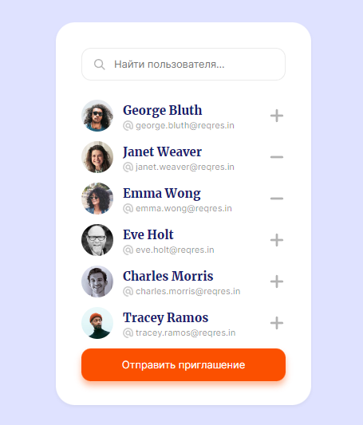
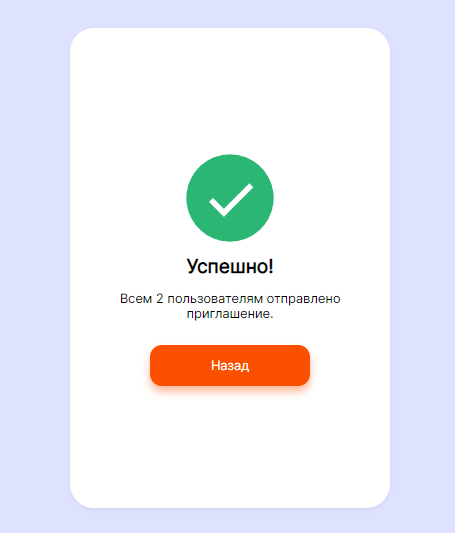

# Invited users app (React)     
Приложение приглашение пользователей  

:white_check_mark: Отправка запроса на бэкенд с помощью fetch и рендер этих данных   
white_check_mark: Скелетон с помощью библиотеки react-content-loader  
white_check_mark: Поиск пользователей по имени и эл.адресу
white_check_mark: Добавление и удаление пользователей из массива приглашений
white_check_mark: Отображение информации о загрузке контента 
  
# Screenshots:          
    
   
